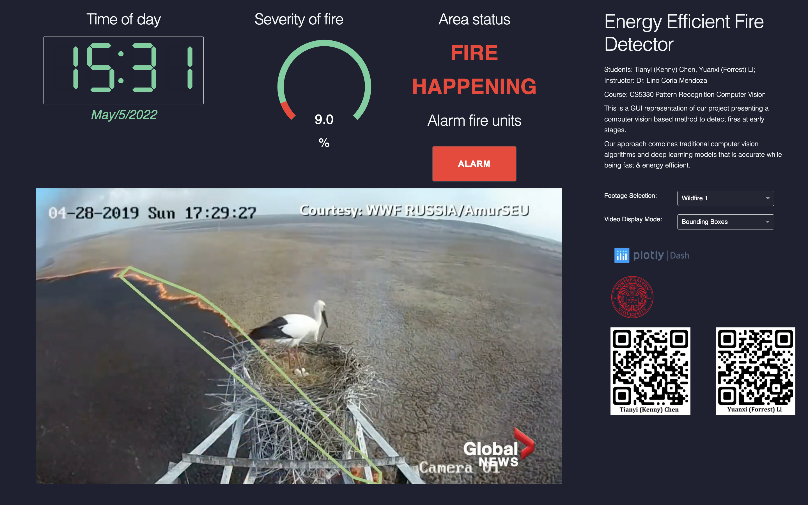

# EnergyEfficientFireDetector

In this project, we present a computer vision based novel method (we call it Big and Little, BnL) that can detect 
fires at their early stages. Our approach combines **traditional computer vision algorithms** (Little) and **deep 
learning models** (Big) that maintains accurate detection of fire while being fast & energy efficient (does not 
require much computing power). The advantages include saving costs with deployment in un-manned area, easily 
deployment on low cost computing devices like Raspberry Pi, etc.

## More on the project

* Project [poster](../Poster.pdf) for a brief introduction to this project.
* Project [report](../Report.pdf) for more in-depth details.

## Contributors

* Tianyi (Kenny) Chen [@3andero](https://github.com/3andero)
* Yuanxi (Forrest) Li [@Forrest_Li](https://github.com/Forrest-Li)

## More demos

Refer to the `dash-demo` folder for more demos like below in our repository.

## Credits

* [ultralytics/yolov5](https://github.com/ultralytics/yolov5)